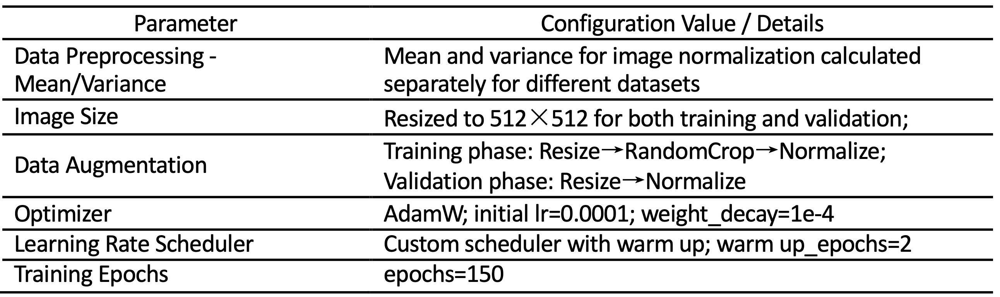

# TSDVision: Robot for Surface Defect Detection in Road Tunnels
Current monitoring and early warning systems for surface defects in highway tunnel linings primarily rely on manual inspections or fixed sensors. The performance of robotic and automated monitoring systems remains limited by challenges in visual perception and autonomous inspection methodologies under complex tunnel environments. This study presents a novel robotic system, TSDVision, designed for monitoring the evolution of surface defects in highway tunnels, enabling automated defect identification, precise localization, quantitative measurement, and growth tracking. 
# Highlights
- Novel robot achieves full-process automation for highway tunnel defect evolution monitoring.
- Two-stage active vision strategy enables ±0.2 mm defect measurement in complex tunnels.
- TDSNet multi-branch model enhances defect detection in challenging tunnel environments.
- Established Tunnel dataset with diverse tunnel lining images captured by robot.
- Field tests in three tunnels validate system robustness for large-scale inspections.
# Get Started
**A. Clone this repository.**
`git clone https://github.com/qifeng22263/TDSNet.git`

**B. Create virtual-env.**
`conda create -n TDSNet python`

**C. Install `pytorch opencv-python numpy torchsummary` according to the official documentation.**

# Training configuration
Experiments were conducted on two NVIDIA RTX 3090 GPUs (CUDA 11.3.1, PyTorch 1.10.0, Windows 10).The model was trained using the AdamW optimizer with the following hyperparameters:
- Initial learning rate: 1e-4
- Weight decay: 1e-4
- Learning rate scheduler: Cosine Annealing
- Warm-up epochs: 2
- Batch size: 3

We performed additional tuning to achieve optimal performance. Detailed training parameters are provided in Table 1.

**Table1:** Details of the training configuration parameters

# Download weights
[百度网盘](https://pan.baidu.com/s/1_ytzx19KUH_IHucElcXU9w?pwd=darq)
