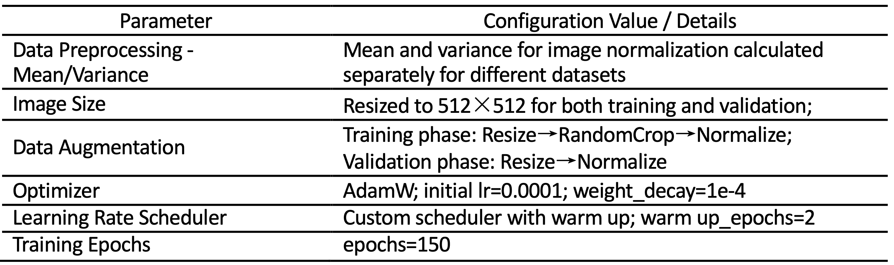

# A Two-Stage Active-Vision Framework for Tunnel Lining Defect Identification, Quantification, and Evolution Monitoring
Tunnel lining defect monitoring is critical to transportation safety, yet existing visual approaches struggle with the domain shifts, low illumination, and multi-scale defects typical of operational tunnels, and rarely close the loop from detection to long-term evolution tracking. This paper presents a coarse-to-fine active-vision framework that unifies anomaly screening, pixel-level segmentation, sub-millimeter quantification, and cross-temporal evolution monitoring for tunnel lining defects. A lightweight on-board multi-defect detector, TunnelScan (a YOLOv8 variant), first screens large-scale imagery to localize candidate defects in a coarse stage; a novel segmentation network, TDSNet, then performs robust pixel-level segmentation in a fine stage. TDSNet adopts a Multi-stage and Multi-branch Encoding Strategy (MMES) with a Dynamic Snake Convolution encoder and a Sobel-guided edge branch to enhance elongated crack extraction and boundary fidelity. A depth-percolation post-processing step recovers thin-crack continuity and enables crack width measurement to ±0.2 mm, while a registration-based scheme supports defect-level evolution tracking and localization within ±20 cm. TDSNet achieves state-of-the-art segmentation results across public benchmarks and a purpose-built TunnelSet dataset (74.6% mIoU, 62.9% Dice on TunnelSet). Deployed on an autonomous rail-mounted acquisition platform in three operational highway tunnels, the framework accomplishes full-coverage, cross-temporal defect monitoring at speeds over 6 km/h with positioning accuracy of ±2 cm, while reducing image data volume by ~89 % compared to full-resolution scanning, providing a practical solution for long-term health monitoring of large-scale civil infrastructure. 
# Highlights
- Coarse-to-fine detection, segmentation, and evolution tracking framework with ~89% data reduction.
- TDSNet with multi-branch encoding and snake convolution achieves state-of-the-art crack segmentation.
- Joint segmentation–measurement yields ±0.2 mm crack width, ±20 cm localization.
- Robotic rail-mounted platform for tunnel inspection at >6 km/h with ±2 cm precision.
# Get Started
**A. Clone this repository.**
`git clone https://github.com/qifeng22263/TDSNet.git`

**B. Create virtual-env.**
`conda create -n TDSNet python`

**C. Install `pytorch opencv-python numpy torchsummary` according to the official documentation.**

# Training configuration
Experiments were conducted on two NVIDIA RTX 3090 GPUs (CUDA 11.3.1, PyTorch 1.10.0, Windows 10).The model was trained using the AdamW optimizer with the following hyperparameters:
- Initial learning rate: 1e-4
- Weight decay: 1e-4
- Learning rate scheduler: Cosine Annealing
- Warm-up epochs: 2
- Batch size: 3

We performed additional tuning to achieve optimal performance. Detailed training parameters are provided in Table 1.

**Table1:** Details of the training configuration parameters

# Download weights
[百度网盘](https://pan.baidu.com/s/1_ytzx19KUH_IHucElcXU9w?pwd=darq)
